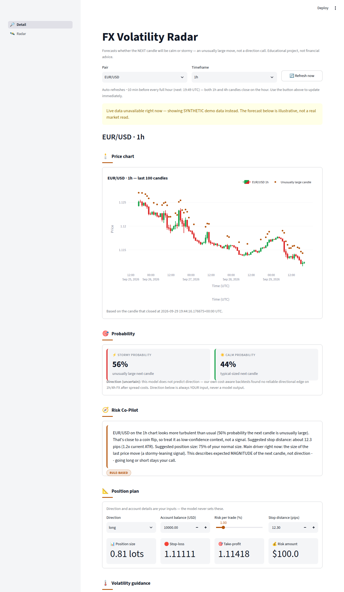
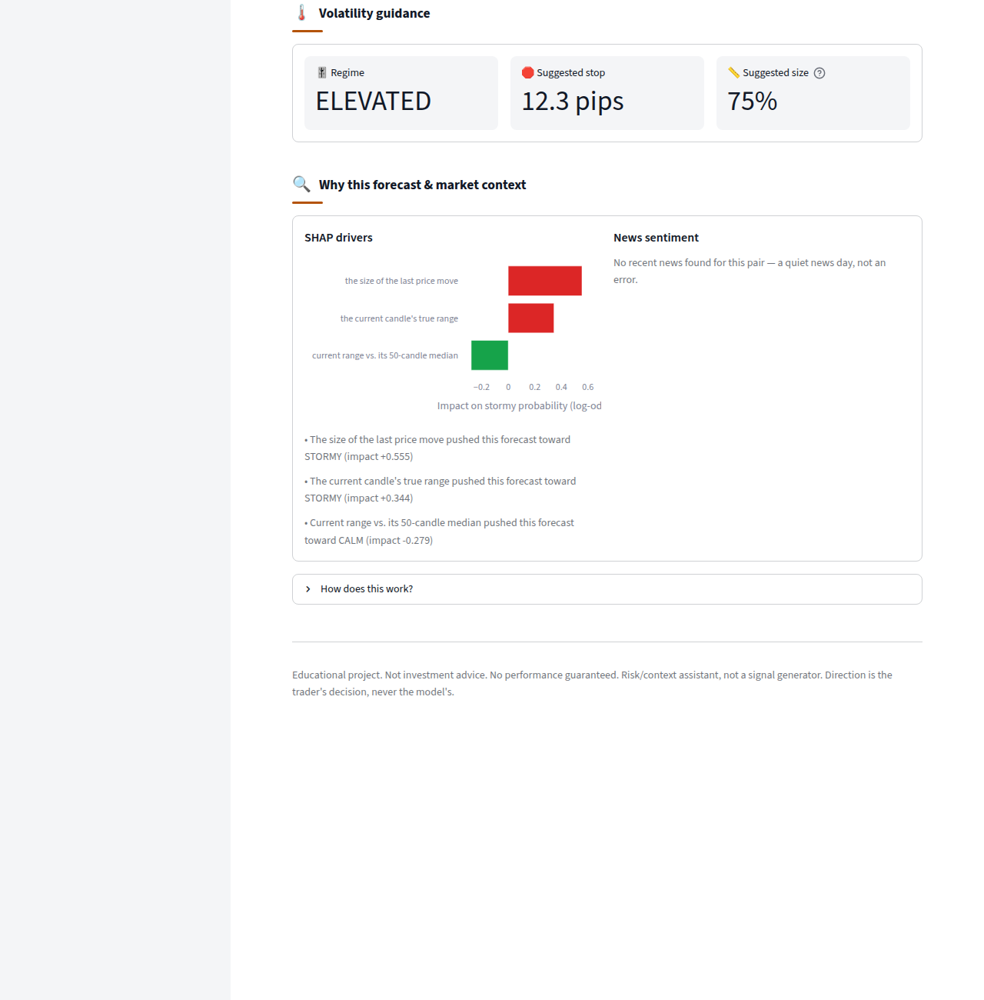
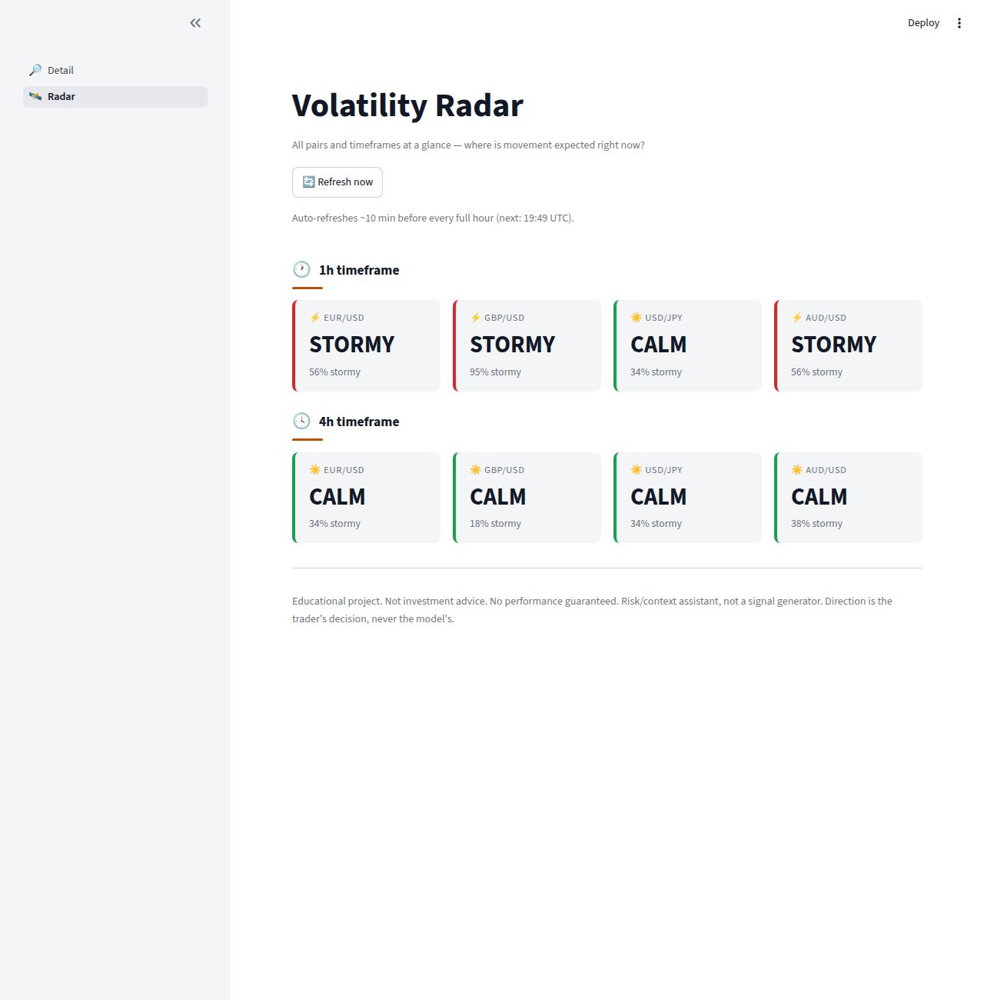

# FX Volatility Radar 📡


-black)


A Streamlit dashboard that forecasts whether the **next** 1h/4h candle on major FX pairs will be **calm or stormy** — an unusually large move, not a direction call — using a calibrated XGBoost model, SHAP interpretability, a live news-sentiment overlay, and a Risk Co-Pilot that turns the forecast into plain-English stop-loss / position-size guidance.

## What it does

Pick a pair (EUR/USD, GBP/USD, USD/JPY, AUD/USD) and a timeframe (1h/4h) and get:
- a **calibrated probability** that the next candle will be unusually large ("stormy") vs typical ("calm")
- **SHAP drivers** explaining exactly why the model says what it says for that forecast
- a **Risk Co-Pilot** statement translating the forecast into a stop-distance and position-size suggestion
- a **live news-sentiment** read for the pair (VADER, no API key required)
- a **Volatility Radar** page showing all pairs × timeframes at a glance

## Why

Most retail FX tools try to predict *direction* — up or down. This project tested that idea with cost-aware backtests and found no reliable directional edge on 1h/4h FX after spread costs — close to a coin flip. So instead of guessing direction, this dashboard answers a question that's actually answerable: **how big could the next move be?** Knowing that lets a trader size positions and set stops sensibly, even without knowing which way price goes.

## How it works

1. **Data**: live 1h candles for 4 major FX pairs via `yfinance`, aggregated to 4h. Falls back to synthetic demo data (clearly flagged in the UI) if the live feed is unavailable, so the dashboard never breaks.
2. **Target**: "stormy" = the next candle's true range exceeds its own trailing 50-candle median — a volatility-regime label, not a price-direction label.
3. **Models**: a simple baseline, RandomForest, and XGBoost are compared; all are **calibrated** (Platt scaling / isotonic regression) so a "70% stormy" forecast actually happens ~70% of the time — verified with the Brier score, not just accuracy.
4. **Explainability**: SHAP breaks down the top drivers behind every individual forecast (e.g. "the London session," "the last candle's true range").
5. **Risk Co-Pilot**: turns the numbers into a short, plain-English risk statement. Rule-based by default (fast, free, never fails); optionally swaps in a real LLM (via Groq) using a fact-constrained prompt so it can never invent numbers, with automatic fallback to the rule-based version if the API call fails.

## Screenshots





## Tech Stack

- Python, pandas, numpy
- [scikit-learn](https://scikit-learn.org/) & [XGBoost](https://xgboost.readthedocs.io/) — model comparison & calibration
- [SHAP](https://shap.readthedocs.io/) — model interpretability
- [VADER](https://github.com/cjhutto/vaderSentiment) — local news sentiment, no API key
- [Streamlit](https://streamlit.io/) + [Plotly](https://plotly.com/python/) — dashboard & charts
- [Groq](https://groq.com/) (optional) — LLM upgrade for the Risk Co-Pilot

## How to run it

1. Clone this repo and navigate into it
2. Create and activate a virtual environment:
```
python -m venv venv
venv\Scripts\activate
```
3. Install dependencies:
```
pip install -r requirements.txt
```
4. (Optional) add a Groq API key to enable the LLM-powered Risk Co-Pilot — without this, the dashboard runs fully on the rule-based statement:
```
# .streamlit/secrets.toml
GROQ_API_KEY = "your-key-here"
```
5. Run the app:
```
streamlit run app.py
```

## Known Limitations

- **No directional signal, on purpose**: this project explicitly does not predict up/down — tested and deliberately dropped (see "Why" above).
- **Live data depends on Yahoo Finance**: if it's unreachable, the dashboard falls back to synthetic demo data and says so clearly in the UI rather than failing silently.
- **Risk Co-Pilot's LLM mode is optional**: off by default; the dashboard is fully functional with zero API keys configured.

## Possible Improvements

- Add more FX pairs and timeframes beyond the current 4 majors / 1h+4h.
- Backtest the stop-loss / position-size guidance itself with real P&L simulation (currently volatility-based, not yet backtested as a strategy).
- Log live predictions over time in a small database to track real-world calibration drift.

---

**Educational project — not financial advice.** No performance guaranteed. This is a risk/context assistant, not a signal generator — direction is always the trader's own decision.
